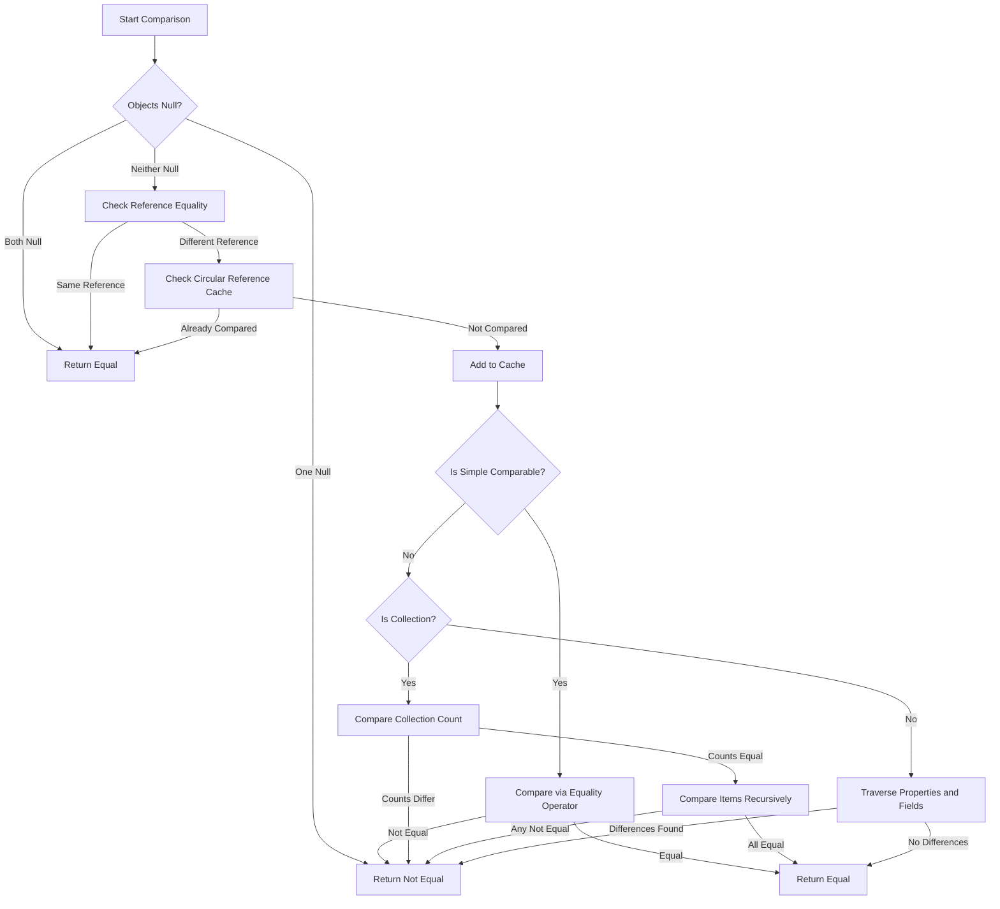

# Workflow Diagram

## Explanation

- Circular Reference Cache prevents infinite loops during recursive comparison.

- Simple Comparable check:
  - Built-in .NET value types, strings, enums, or types handled via CustomSimpleTypePredicate.

- Collection Comparison:

  - Compares only the count first (performance optimization).

  - Then performs recursive item comparison (order-insensitive).

## Legend

- Equal Path (C/J): Indicates no differences detected.

- Not Equal Path (D): Indicates at least one difference detected.